# saleor-checkout

Extensible, powerful checkout powered by Saleor API. WooHOO

## Setup

This monorepo uses [PNPM](https://pnpm.io/) as a package manager and [Turborepo](https://turborepo.org/) for building packages.

### Monorepo structure

Here's the list of each app and shared package in the monorepo (click to see a README of that project)

#### Apps

- [`apps/checkout`](apps/checkout/README.md): an SPA React 18 checkout app, ready to be extended/modified
- [`apps/checkout-app`](apps/checkout-app/README.md): an Next.js Saleor app with dashboard for managing settings and theme, backend for checkout SPA, ready to be extended/modified

#### Packages

- `packages/ui-kit`: UI kit for checkout and [React Storefront](https://github.com/saleor/react-storefront)
- `packages/config`: `eslint` configurations (includes `eslint-config-next` and `eslint-config-prettier`)
- `packages/tsconfig`: `tsconfig.json`s used throughout the monorepo

### Install dependencies

```
pnpm i
```

### Build

To build all apps and packages, run the following command:

```
pnpm run build
```

You can also build a specific app or package by running this command:

```bash
pnpm run build:checkout
```

In this example, we'll only build `apps/checkout`

### Develop

Create a tunnel for `checkout-app`:

```bash
cd apps/checkout-app && npx saleor app tunnel 3000
```

> Note: the process needs to be running in the background

Before you start the server, you need to change default environment variables. Create `.env.local` file in each app:

- [`apps/checkout-app`](./apps/checkout-app/README.md#env-variables)
- [`apps/checkout`](./apps/checkout/README.md#local-development)

To run the development server for all the apps, use the following command:

```
pnpm run dev
```

You can also run only a specific app by running this command:

```bash
cd apps/checkout && pnpm dev
```

## Deployment

### Env variables

Change environment variables inside `.env` file:

- `SALEOR_API_URL` — GraphQL endpoint of your Saleor

  Example:

  ```
  https://my-env.eu.saleor.cloud/graphql/
  ```

  > To run sandbox Saleor environment in [Saleor Cloud](https://cloud.saleor.io/) use this command:
  >
  > ```bash
  > npx saleor project create && npx saleor environment create
  > ```
  >
  > You can also run Saleor locally. See [Saleor docs](https://docs.saleor.io/docs/3.x/developer/installation) for more instructions

- `CHECKOUT_APP_URL` — URL of deployed Checkout App

  Example:

  ```
  https://saleor-checkout-app.vercel.app
  ```

  > See [guide below](#checkout-app) on how to deploy the Checkout App

There are more environment variables available in each app. Go to their README's to learn more

### Vercel

The repo needs to be hosted on GitHub or some other git repository. Before you start, fork the repo to your account or organization.

- Authenticate the Turborepo CLI with your Vercel account

```
pnpm dlx turbo login
```

- Link the repo to a Vercel scope to enable the Remote Caching feature

```
pnpm dlx turbo link
```

> Remote Caching drastically reduces build times if you work in a team. Learn more about it at [Turborepo documentation](https://turborepo.org/docs/core-concepts/remote-caching) and [Vercel documentation](https://vercel.com/docs/concepts/monorepos/remote-caching)

#### Checkout App

1. Start [creating new project](https://vercel.com/docs/concepts/projects/overview#creating-a-project) on Vercel and select your forked GitHub repo

> Note: Vercel now doesn't support importing the entire monorepo, you will need to set up a project yourself for each app inside `/apps` folder

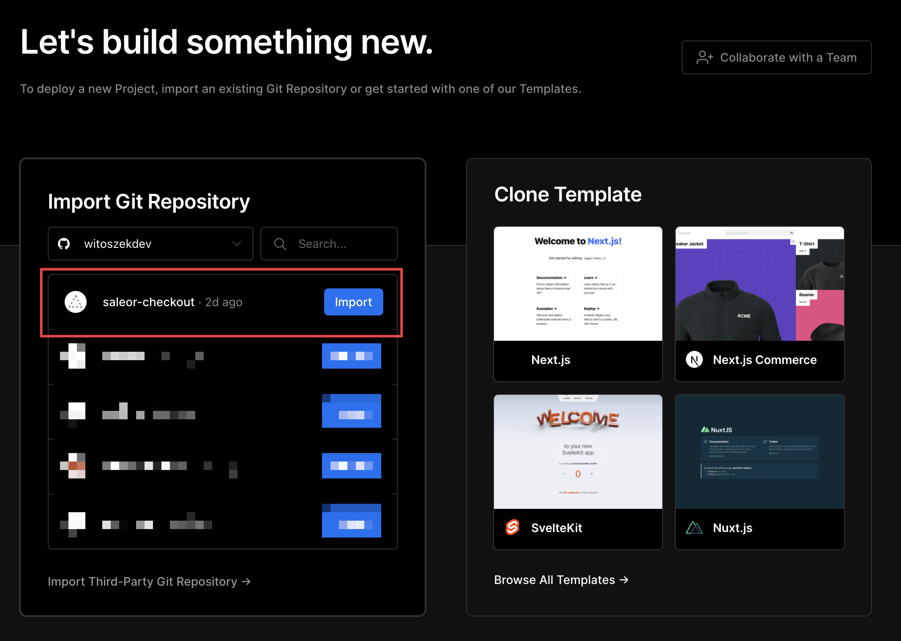

2. From the configuration page:

- Provide your project name (for example `saleor-checkout-app`)
- Select framework to Next.js
- Choose the root directory to be `apps/checkout-app`
- Override the build command to:

```bash
cd ../.. && pnpm run build:checkout-app
```

- Add environment variables:
  - `SETTINGS_ENCRYPTION_SECRET` — Random string used for encrypting apps configuration (you can generate it using `openssl rand -hex 256`)
  - _Optional_: `NEXT_PUBLIC_SALEOR_API_URL` — if you want to override the value of `SALEOR_API_URL` stored inside `.env` file in the root of the repository

Here's the final result on configuration page:

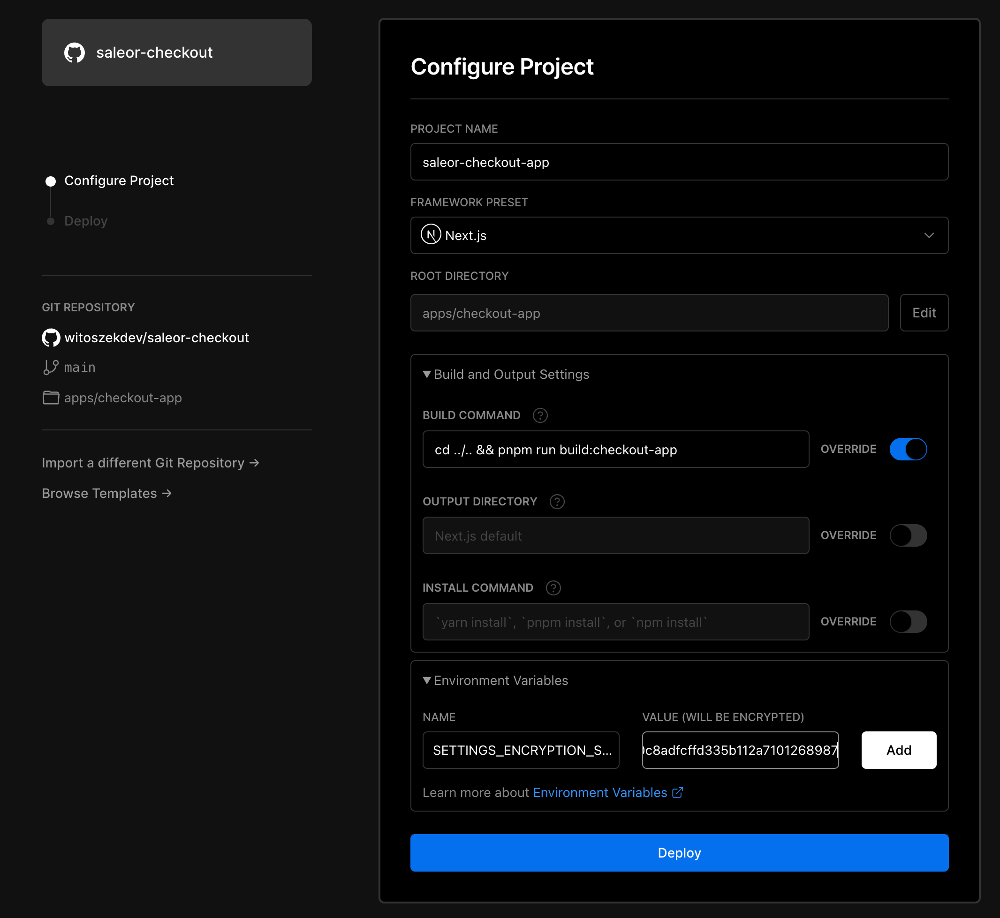

Click deploy and wait until the app is deployed

3. Update environment variables in repository

Update `CHECKOUT_APP_URL` in `.env` file located at the root of monorepo to be your deployment URL

Example:

```
https://saleor-checkout-app.vercel.app
```

4. Install the app in Saleor

Grab the deployed app URL from Vercel and add `/api/manifest`. This URL points to the manifest file that is required for installing the app in Saleor

> Example manifest URL:
>
> ```
> https://saleor-checkout-xyz-myusername.vercel.app/api/manifest
> ```

You can install the app by using:

- [Saleor Dashboard](https://github.com/saleor/saleor-dashboard)

```
http://<YOUR_SALEOR_URL>/dashboard/apps/install?manifestUrl=<YOUR_MANIFEST_URL>
```

- [Saleor CLI](https://github.com/saleor/saleor-cli)

```
saleor app install
```

- [Saleor Core manage.py script](https://docs.saleor.io/docs/3.x/developer/extending/apps/installing-apps#installing-third-party-apps)
- [Saleor GraphQL API](https://docs.saleor.io/docs/3.x/developer/extending/apps/installing-apps#installation-using-graphql-api)

> **PROTIP 💡**: If you want your app to automatically update whenever you push changes to the `main` branch, make sure to use **production** domain from Vercel (not deployment domain) for your manifest URL.
>
> ❌ Deployment domain (won't update app after push):
>
> ```
> https://saleor-checkout-app-jluy793b2-myusername.vercel.app/api/manifest
> ```
>
> ✅ Production domain:
>
> ```
> https://saleor-checkout-app.vercel.app/api/manifest
> ```
>
> To see which domain is used for production go to [Vercel Dashboard](https://vercel.com) > Settings > Domains:
> 

5. Generate app token

After the app was installed, generate it's `authToken`

- [Saleor CLI](https://github.com/saleor/saleor-cli)

```
saleor app token
```

- [Saleor GraphQL API](https://docs.saleor.io/docs/3.x/developer/api-reference/mutations/app-token-create)

```graphql
mutation {
  appTokenCreate(input: { name: "Vercel", app: "<MY_APP_ID>" }) {
    authToken
  }
}
```

Where `<MY_APP_ID>` is the app `id`. You can retrieve the `id` by using this GraphQL query:

```graphql
query {
  apps(first: 10) {
    edges {
      node {
        id
        name
      }
    }
  }
}
```

outputs this:

```jsonc
{
  "data": {
    "apps": {
      "edges": [
        {
          "node": {
            "id": "QXBwOjQ=", // <- this is the app id
            "name": "Checkout"
          }
        }
      ]
    }
  }
}
```

6. Update environment variables in Vercel

You have to add additional environment variables for Checkout App in Vercel:

- `SALEOR_APP_ID` — ID of the app
- `SALEOR_APP_TOKEN` — Token you've just generated

> 🚨 These values are secrets — don't store them inside your git repository

Make sure that you also have "Automatically expose System Environment Variables" selected

Here's how the configuration should look like in the end:


After you're done, re-deploy the app

> ⚠️ Make sure that you **didn't** select the "Redeploy with existing Build Cache." option

7. 🥳 Congrats! Payment app is now ready to be used!

#### Checkout SPA

1. Start by creating another project on Vercel, just like we did in [Checkout App setup](#checkout-app), select the same repository

2. On the configuration page:

- Provide your project name (for example `saleor-checkout`)
- Select framework to Create React App
- Choose the root directory to be `apps/checkout`
- Override the build command to:

```bash
cd ../.. && pnpm run build:checkout
```

- _Optional_: customise [environment variables](./apps/checkout/README.md#env-variables):
  - `REACT_APP_CHECKOUT_APP_URL` — URL of the deployed [Checkout App](#checkout-app).
  - `REACT_APP_SALEOR_API_URL` — URL of Saleor GraphQL API endpoint

> By default, those environment variables are taken from [`.env`](./.env) file in root of the monorepo. You don't need to provide env variables in Vercel if you want to use the values from `.env` file.

Here's the final result on configuration page:

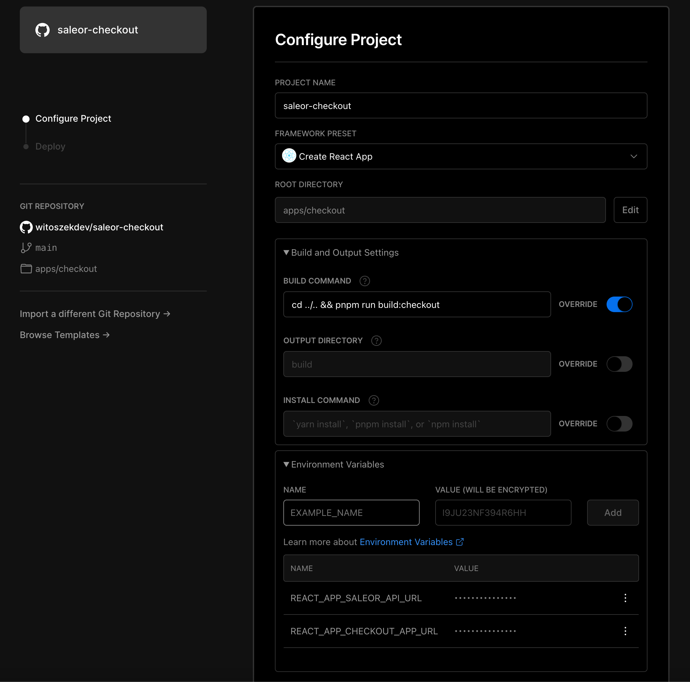

Click deploy and wait until the app is deployed

## Payment gateways configuration

Checkout app supports two payment gateways that you can configure:

<a href="https://www.mollie.com/en">
  <picture>
    <source media="(prefers-color-scheme: dark)" srcset="./docs/logos/mollie_light.svg">
    <source media="(prefers-color-scheme: light)" srcset="./docs/logos/mollie_dark.svg">
    
  </picture>
</a>

<br>

[](https://www.adyen.com/)

Payment gateways can be configured in the Checkout app inside Saleor dashboard.
Go to **Apps > Third party apps > Checkout**.

You can toggle, which payment gateway handles each different payment options per channel:

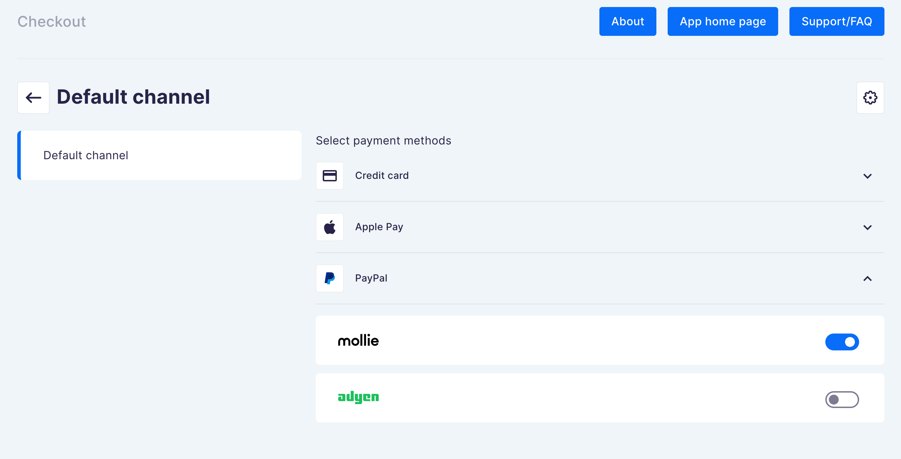

To use payment gateway, you need to provide its credentials. You can do that by clicking settings icon in channel configuration page


### Mollie

1. [Sign up for Mollie account](https://www.mollie.com/dashboard/signup?lang=en)

2. In your Mollie dashboard, select: Developers > API keys and copy **API key** and **Profile ID**

- **Live API key** - for production environment
- **Test API key** - for development environment

3. In Checkout app configuration, enter the data you've just copied

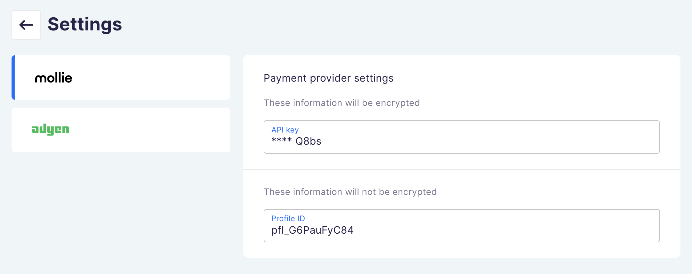

### Adyen

Saleor Checkout uses Adyen's [Pay by Link flow](https://docs.adyen.com/unified-commerce/pay-by-link)

1. [Sign up for Adyen test account](https://www.adyen.com/signup)

2. In [test Customer Area](https://ca-test.adyen.com/) create [new merchan account](https://ca-test.adyen.com/ca/ca/accounts/show.shtml)

3. [Create new API credentials](https://ca-test.adyen.com/ca/ca/config/api_credentials_new.shtml). Go to Developers > API credentials > Create new credential

Select "Web service user" and enter some description (for example "Saleor Checkout")

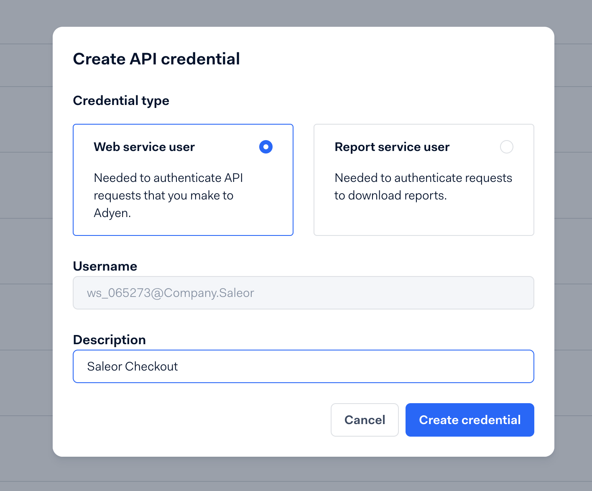

4. Copy **API key** from newly generated API credentials and paste it in Checkout app configuration > Adyen > **Private API key**

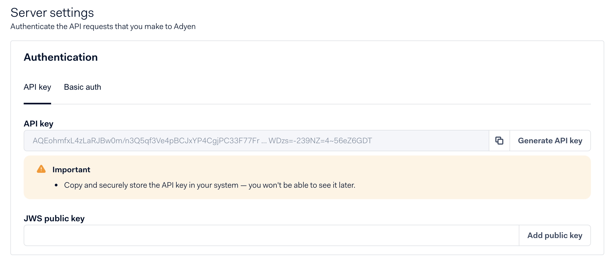


5. Click **"Generate client key"** and copy it to clipboard, paste it in Checkout app configuration > Adyen > **Public client key**

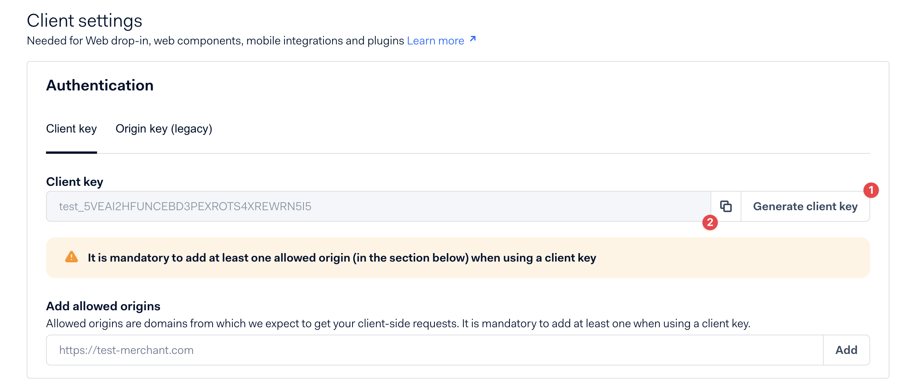

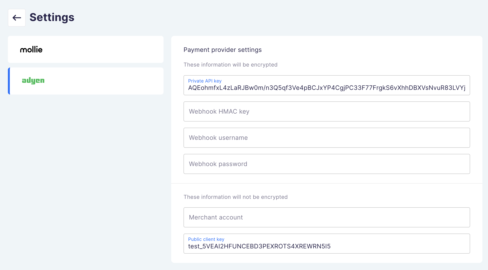

6. **Add allowed origin** to your Client key, paste URL of your deployed [Checkout SPA](#checkout-spa) and click **"Add"**

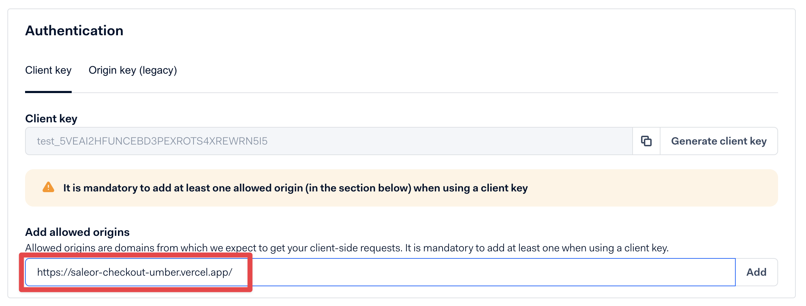

7. **Save changes** you've made to API credential

8. [Create standard notification webhook](https://docs.adyen.com/unified-commerce/pay-by-link/payment-links/api#webhooks). Go to Developers > [Webhooks](https://ca-test.adyen.com/ca/ca/config/showthirdparty.shtml) > "+ Webook" > ["Standard notification"](https://ca-test.adyen.com/ca/ca/config/configurethirdparty.shtml?method:add&selectedMimetype=notifications)

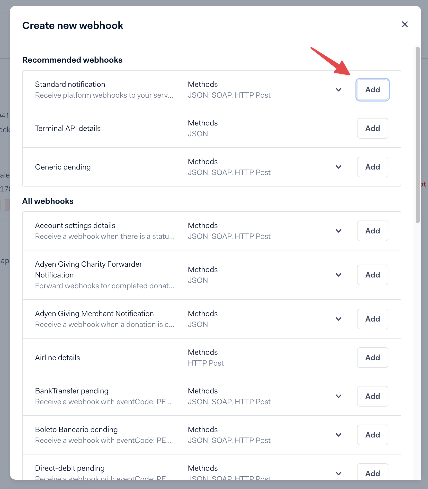

Fill out the webhook details:

- **Description** - enter some description for your webhook (ex. Saleor Checkout notifications)
- **Server configuration**
  - **URL** - URL of your deployed [Checkout App](#checkout-app) + `/api/webhooks/adyen`

```
<YOUR_CHECKOUT_APP_URL>/api/webhooks/adyen
```

- Other settings should be set to default:
  - **Method**: JSON
  - **SSL version**: TLSv1.2
  - **Service version** - 1

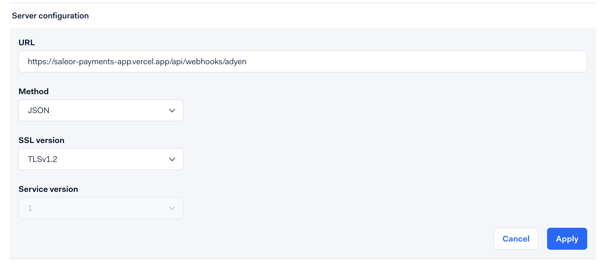

- **Merchant accounts** - choose "Include only specific merchant accounts" and select the merchant account you'll use for checkout, the name must be provided in Checkout App configuration


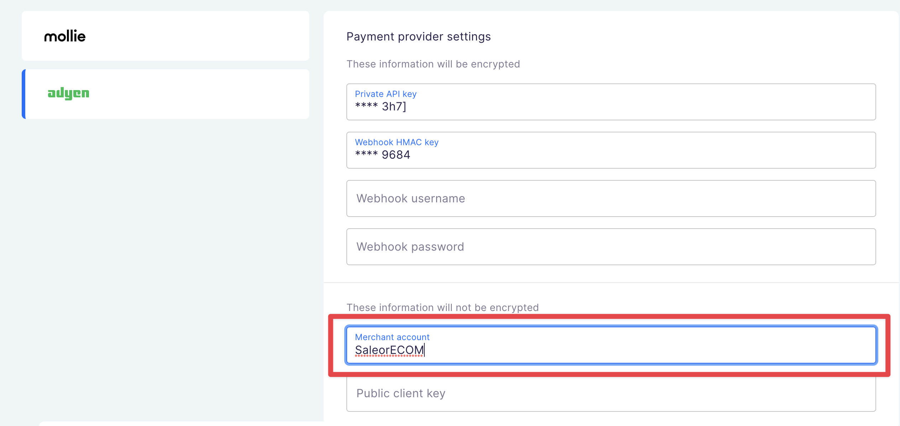

- **Events** - leave events selected by default
- **Security**
  - **Basic authentication** - arbitrary username and password, you can use `openssl rand -hex 64` to generate random password
  - **HMAC Key** - click "Generate" and copy the key
  - Those 3 values: `username`, `password` and `HMAC Key` must be provided in Checkout App configuration

This is how your webhook configuration should look like in Adyen:

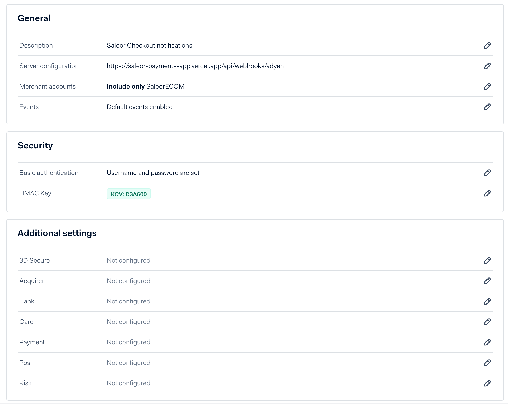

This is how your Checkout App configuration should look like in Saleor dashboard:

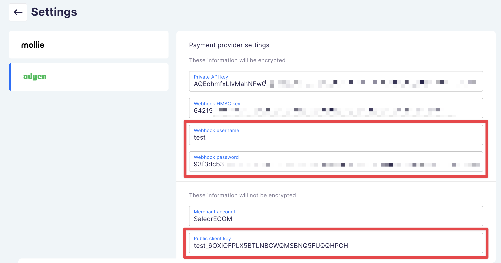

9. Save settings in Adyen and in Checkout App configuration

10. Test webhook configuration in Adyen

Click "Test configuration" button after you've saved the configuration.

Select **"AUTHORISATION"** from the list and click "Test"

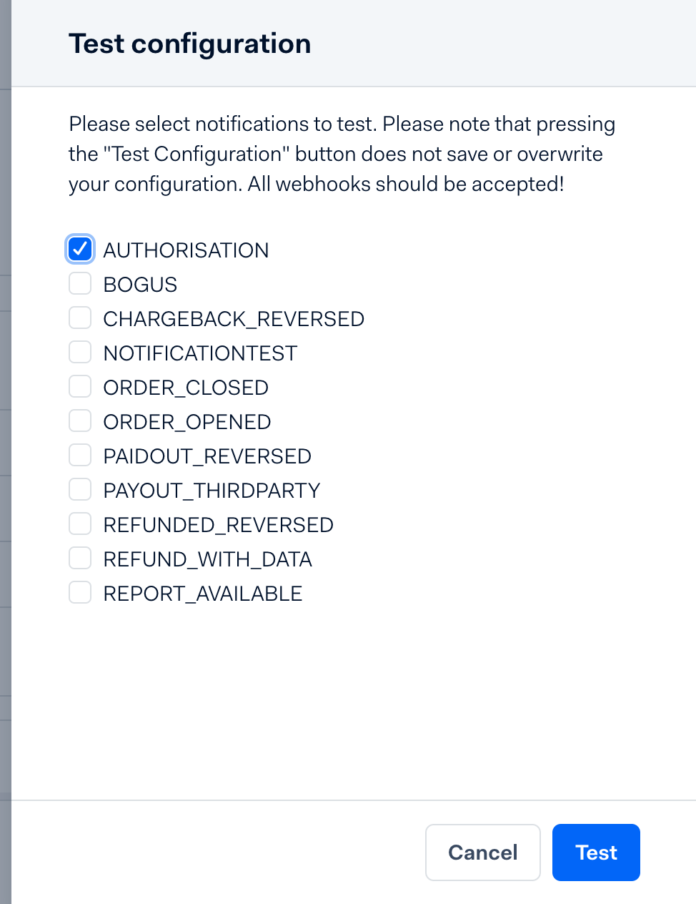

Adyen will make a call to your webhook. If everythign is configured properly you'll see that the test was successful:

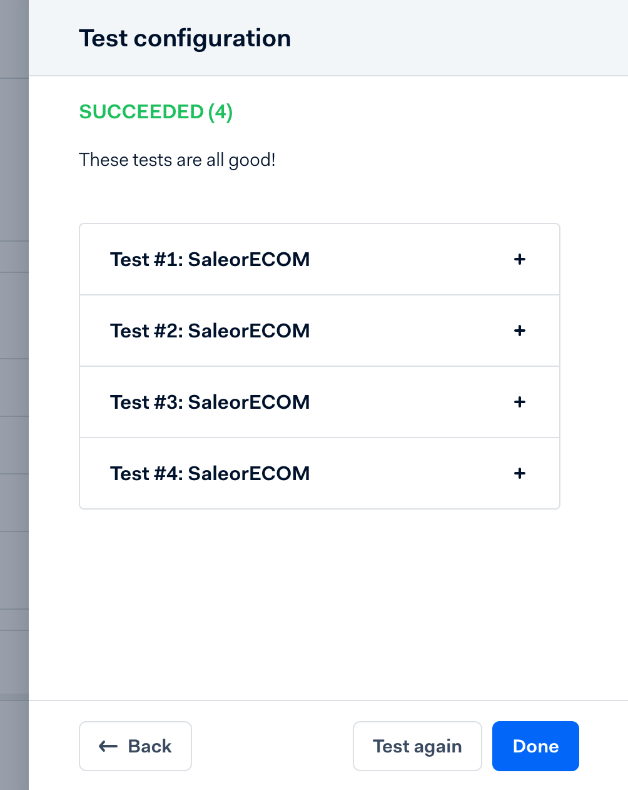

> Note: It can take a while for your webhook configuration to propagate in Adyen after you save it. If the test failed, give it a few minutes before you try again

If the response failed because of invalid configuration in Adyen, Checkout App will return the reason in response:

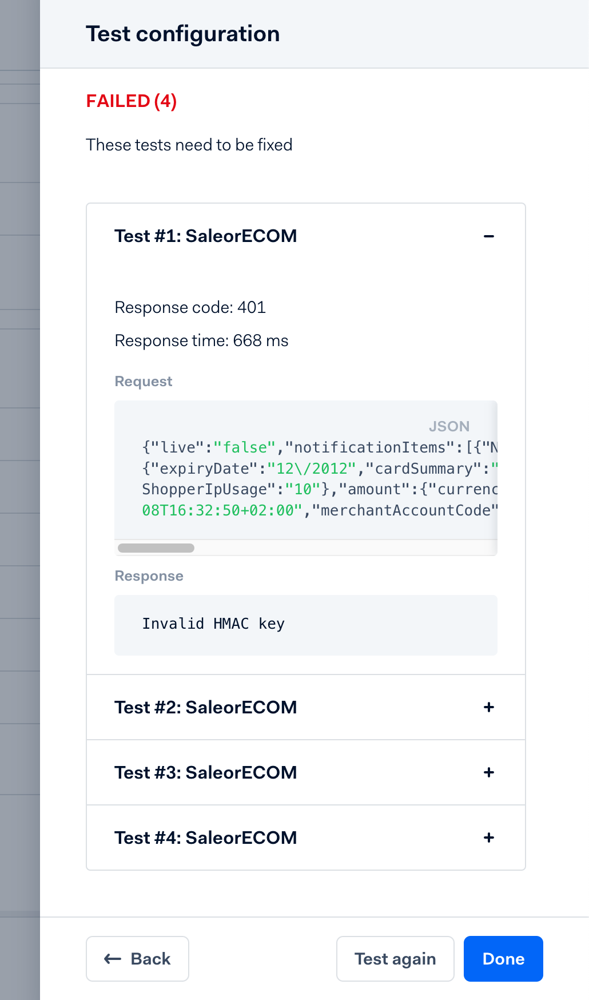

11. After you've tested your webhook, enable it, by clicking the toggle button

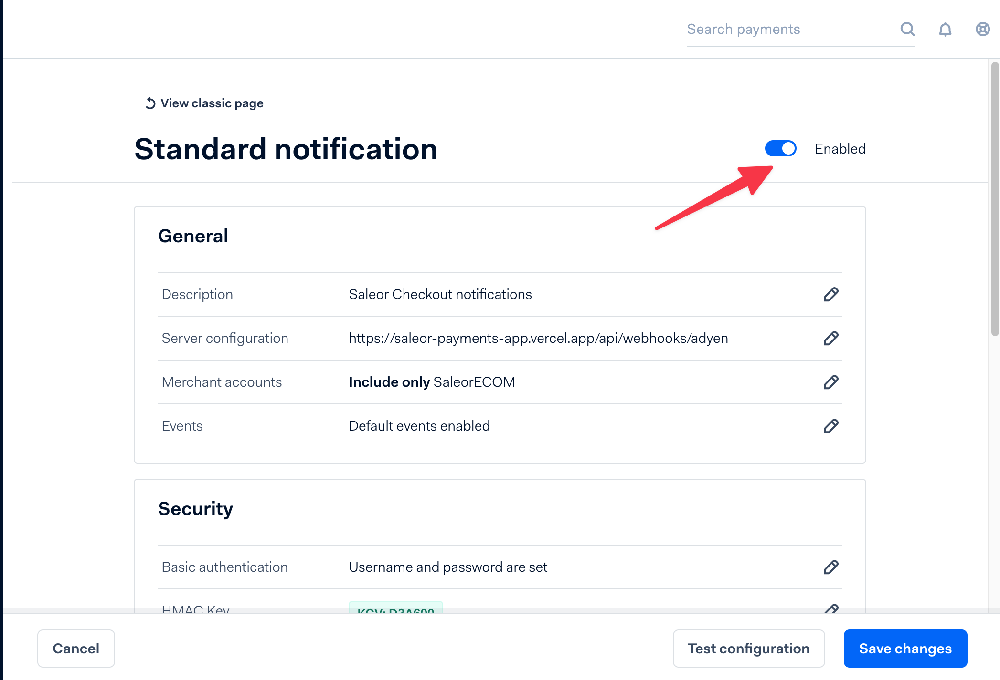

12. 🥳 Congrats! You've finished configuration of Adyen payment gateway
